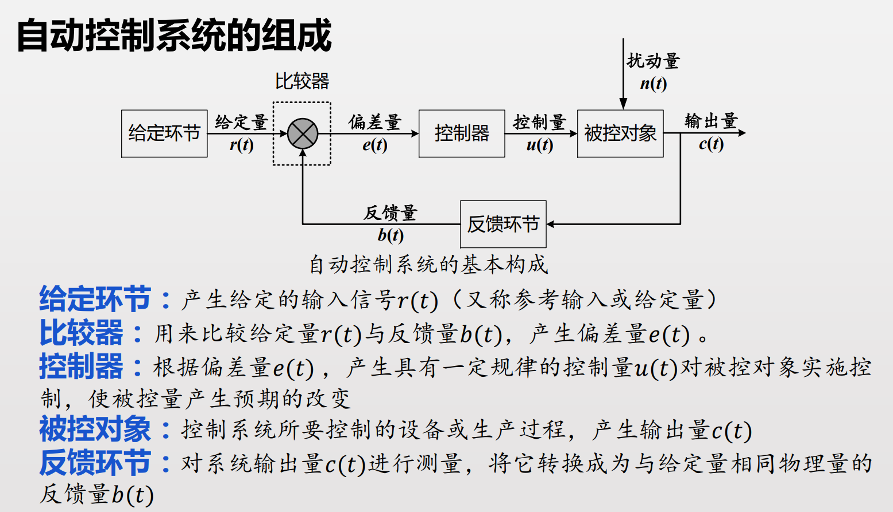
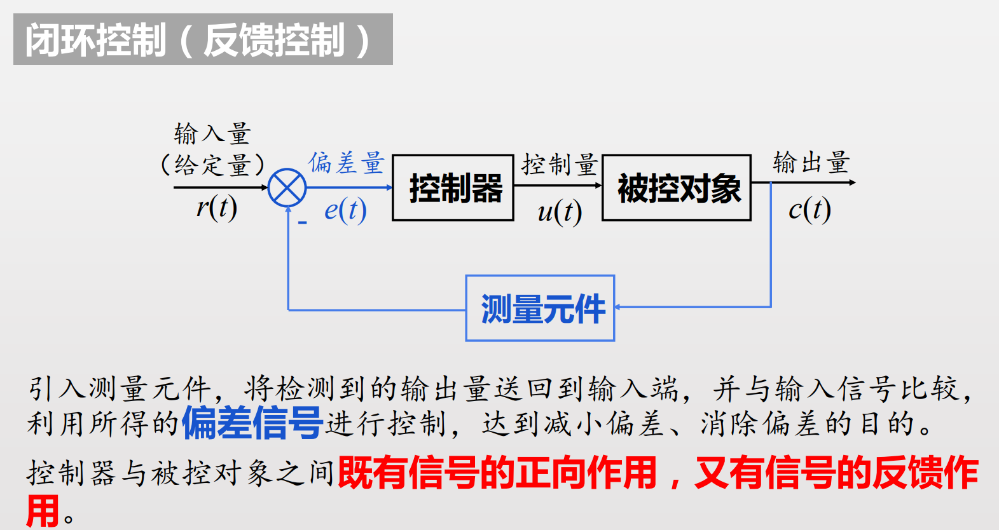
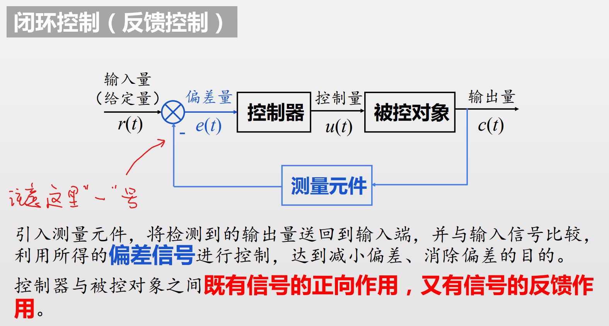
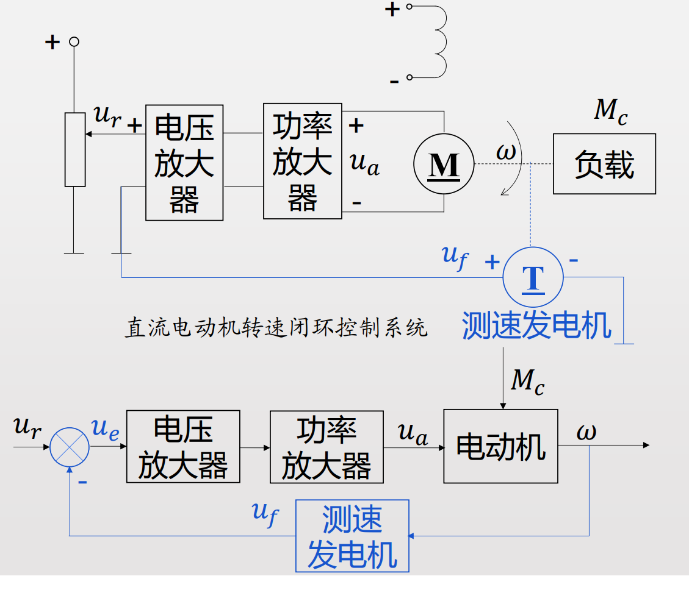
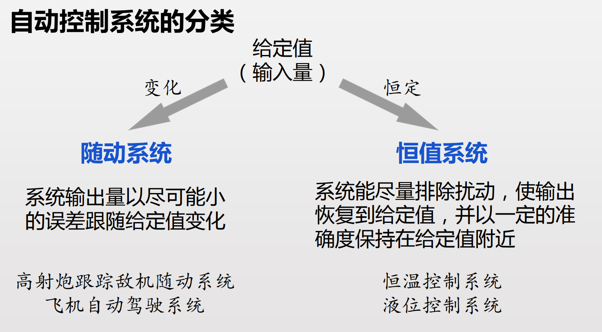
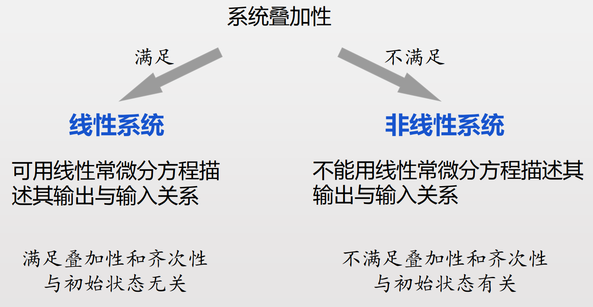
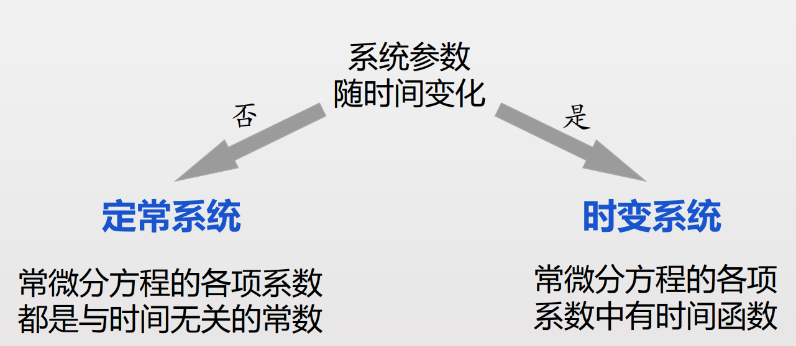
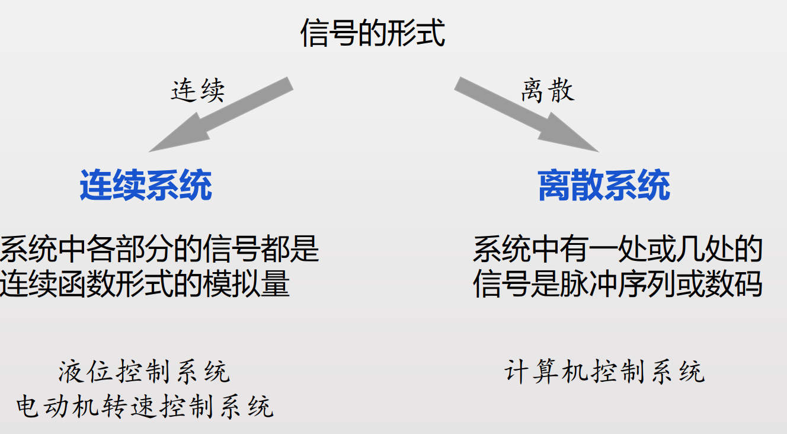
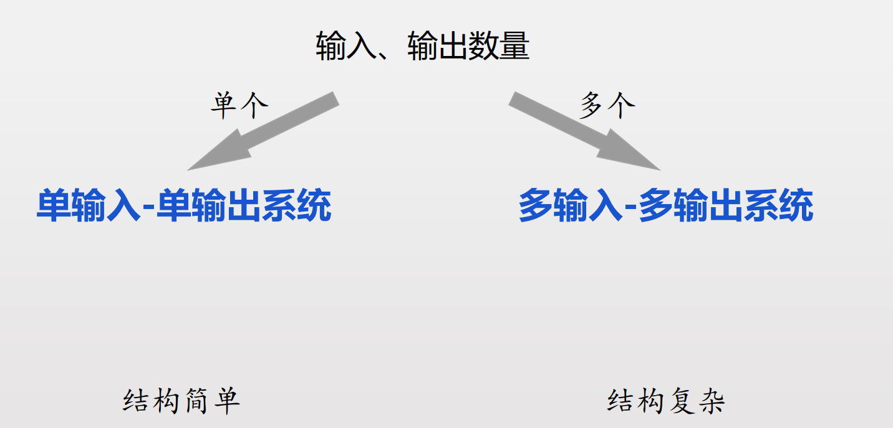

<!--
 * @Author: Ashington ashington258@proton.me
 * @Date: 2024-09-05 09:56:39
 * @LastEditors: Ashington ashington258@proton.me
 * @LastEditTime: 2024-09-05 11:25:40
 * @FilePath: \Automatic_control_principle\1-引论\引论.md
 * @Description: 请填写简介
 * 联系方式:921488837@qq.com
 * Copyright (c) 2024 by ${git_name_email}, All Rights Reserved. 
-->

- [引论](#引论)
  - [闭环控制](#闭环控制)

# 引论

## 闭环控制

闭环控制是输出偏差量，**比较**就是做差，做和并不能比较，因此反馈一定是做差，**这里所以是**负反馈

求电压偏差，即比较，最后将其放大

**特点**
- 系统内部存在**反馈**，信号流动构成闭回路
- **偏差**起调节作用

**线性定常系统**是本课程的研究系统