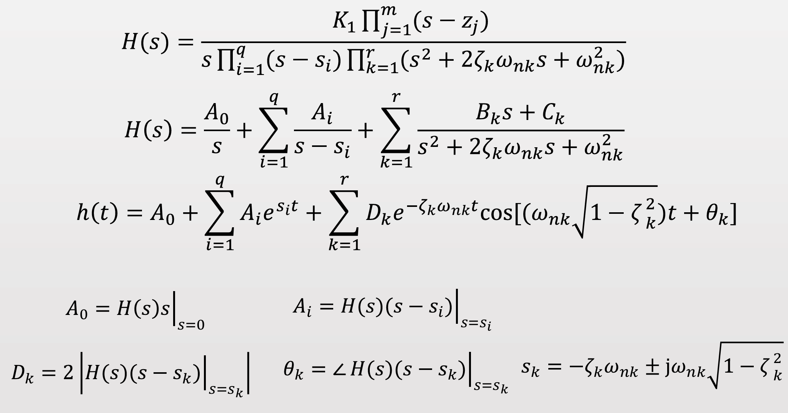
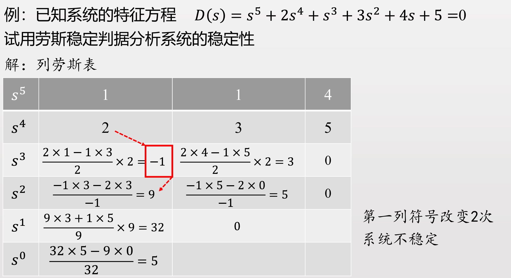

# 线性系统的时域分析

- [线性系统的时域分析](#线性系统的时域分析)
  - [1 典型的输入信号](#1-典型的输入信号)
  - [2 线性定常系统的时域响应](#2-线性定常系统的时域响应)
  - [3 性能指标](#3-性能指标)
  - [4 一阶系统的暂态响应{惯性环节}](#4-一阶系统的暂态响应惯性环节)
    - [4.1 单位阶跃响应](#41-单位阶跃响应)
    - [4.2 单位脉冲响应](#42-单位脉冲响应)
    - [4.3 单位斜坡响应](#43-单位斜坡响应)
    - [4.4 单位加速度响应](#44-单位加速度响应)
    - [4.5 小结](#45-小结)
  - [5 二阶系统的暂态响应](#5-二阶系统的暂态响应)
    - [5.1 $ \\zeta \< 0$不稳定](#51--zeta--0不稳定)
    - [5.2 $ \\zeta = 0$等值振荡](#52--zeta--0等值振荡)
    - [5.3 $\\zeta \> 0$](#53-zeta--0)
      - [5.3.1 $\\zeta \> 1$过阻尼系统](#531-zeta--1过阻尼系统)
      - [5.3.2 $\\zeta = 1$ 临界阻尼系统](#532-zeta--1-临界阻尼系统)
      - [5.3.3 $0\<\\zeta\<1$ 欠阻尼系统](#533-0zeta1-欠阻尼系统)
    - [5.4 小结](#54-小结)
    - [5.5 二阶系统性能指标](#55-二阶系统性能指标)
      - [5.5.1 上升时间](#551-上升时间)
      - [5.5.2 峰值时间](#552-峰值时间)
      - [5.5.3 `最大超调量`稳](#553-最大超调量稳)
      - [5.5.4 `调整时间`快](#554-调整时间快)
    - [5.6 二阶系统暂态性能的改善](#56-二阶系统暂态性能的改善)
      - [5.6.1 测速反馈](#561-测速反馈)
      - [5.6.2 比例微分(PD控制)](#562-比例微分pd控制)
      - [5.6.3 对比](#563-对比)
  - [6 高阶系统的暂态系统](#6-高阶系统的暂态系统)
    - [6.1 极点的影响](#61-极点的影响)
    - [6.2 零点的影响](#62-零点的影响)
    - [6.3 主极点](#63-主极点)
  - [8 系统的稳定性](#8-系统的稳定性)
  - [9 劳斯-赫尔维茨稳定判据](#9-劳斯-赫尔维茨稳定判据)
  - [10 系统稳定性优化](#10-系统稳定性优化)
  - [11  控制系统的稳态误差(稳定性)](#11--控制系统的稳态误差稳定性)

## 1 典型的输入信号

**总结**

## 2 线性定常系统的时域响应

$$a_0\frac{\mathrm{d}^nc(t)}{\mathrm{d}t^n}+a_1\frac{\mathrm{d}^{n-1}c(t)}{\mathrm{d}t^{n-1}}+\ldots+a_{\mathrm{n-1}}\frac{\mathrm{d}c(t)}{\mathrm{d}t}+a_{\mathrm{n}}c(t)\\=b_0\frac{\mathrm{d}^mr(t)}{\mathrm{d}t^m}+b_1\frac{\mathrm{d}^{m-1}r(t)}{\mathrm{d}t^{m-1}}+\ldots+b_{m-1}\frac{\mathrm{d}r(t)}{\mathrm{d}t}+b_mr(t)$$

==我们习惯上使用单位阶跃响应为例子==

## 3 性能指标

- **暂态性能**
  1. `最大超调量`
  2. 峰值时间：
  3. 上升时间：
  4. `调整时间`：
- **稳态性能**
  1. 稳态误差：

## 4 一阶系统的暂态响应{惯性环节}

### 4.1 单位阶跃响应

**当我们计算调整时间的时候需要对表达式进行化成标准形式，首位标准型等**

才能是$t_s = 3\tau$

### 4.2 单位脉冲响应

**脉冲相应可以用于黑盒测试，不知道什么系统的时候可以输入脉冲查看相应线形**

### 4.3 单位斜坡响应

**稳态分量$(t-\tau)$**

### 4.4 单位加速度响应

无法跟踪

### 4.5 小结

## 5 二阶系统的暂态响应

- **二阶系统的重要参数**
  - 阻尼比
  - 自然震荡角频率

### 5.1 $ \zeta < 0$不稳定

### 5.2 $ \zeta = 0$等值振荡

### 5.3 $\zeta > 0$

#### 5.3.1 $\zeta > 1$过阻尼系统

**近似一阶系统**

#### 5.3.2 $\zeta = 1$ 临界阻尼系统

#### 5.3.3 $0<\zeta<1$ 欠阻尼系统

*常见状态*

振荡衰减

### 5.4 小结

### 5.5 二阶系统性能指标

性能指标中最重要的就是稳和快

#### 5.5.1 上升时间

#### 5.5.2 峰值时间

#### 5.5.3 `最大超调量`稳

#### 5.5.4 `调整时间`快

### 5.6 二阶系统暂态性能的改善

#### 5.6.1 测速反馈

#### 5.6.2 比例微分(PD控制)

#### 5.6.3 对比

****

**响应形式只跟极点相关，和零点无关，响应波形形态之和极点相关，所以优化控制算法无法改变响应波形的形状，但是却可以改善响应时间，PD控制本质是增加开环零点，改善动态性能指标。**

**附加闭环零点会增大超调量，所以此时零点开闭环十分重要!**

## 6 高阶系统的暂态系统

**工程应用上经常将高阶系统拆分简化为一阶系统，二阶系统或其线性组合**

### 6.1 极点的影响

### 6.2 零点的影响

**偶极子对暂态相应的影响可以忽略，一对零极点可以忽略掉**
**忽略偶极子时，保证原系统的增益不变**

### 6.3 主极点

## 8 系统的稳定性

$$c(t)=\sum_{i=1}^qA_ie^{s_it}+\sum_{k=1}^rD_ke^{-\zeta_k\omega_{nk}t}\cos\left[\left(\omega_{nk}\sqrt{1-\zeta_k^2}\right)t+\theta_k\right]$$

要求两个衰减项即指数部分小于零，即保持衰减.

因此要求极点的实部小于零，即实部为负。

实部代直流分量，即衰减项，虚部代表振荡
**在虚轴上保持振荡，所以虚轴也不可取**

## 9 劳斯-赫尔维茨稳定判据

劳斯-赫尔维茨判定（Routh-Hurwitz Criterion）是一种用于判断线性系统特征方程根的稳定性的方法。特别地，它可以用来确定多项式的所有根是否位于左半平面，从而判断系统的稳定性。以下是劳斯-赫尔维茨判定的基本原理和步骤。

**特征方程**传递函数的分母，因为分母决定了函数的波形，形态。
是的，特征方程可以被视为微分方程的代数描述。具体来说，特征方程将微分方程的动态特性转化为代数方程，从而使得分析和解决问题更加简便。以下是这一观点的详细阐述：

**特征方程可以看作是微分方程的代数描述。**

**微分方程与特征方程的关系**

对于一个线性常微分方程（ODE），例如：

$$
\frac{d^n y(t)}{dt^n} + a_{n-1} \frac{d^{n-1} y(t)}{dt^{n-1}} + \ldots + a_1 \frac{dy(t)}{dt} + a_0 y(t) = 0
$$

可以通过假设解的形式 \( y(t) = e^{st} \) 来转换为特征方程。将该形式代入微分方程，可以得到一个关于 \( s \) 的代数方程，称为特征方程：

$$
s^n + a_{n-1} s^{n-1} + \ldots + a_1 s + a_0 = 0
$$

**特征方程的角色**

- **根的含义**：特征方程的根（特征值）对应于微分方程的解的形式。根的实部和虚部决定了解的稳定性和振荡特性。
- **简化分析**：通过分析特征方程，可以快速判断系统的动态特性，而无需直接求解微分方程。

**状态空间表示**

在状态空间模型中，特征方程同样起着重要作用。对于状态方程：

$$
\dot{x}(t) = Ax(t) + Bu(t)$$

特征方程为：

$$
\text{det}(sI - A) = 0
$$

这里，\( A \) 是系统的状态矩阵，特征方程描述了系统的动态特性。

==因此劳斯-赫尔维茨判定是一种代数判定==

**劳斯稳定判据**
1. 方程系数全部正值(不可为0，即不能缺项)
2. 劳斯表第一列全是正号

**判断稳定性用单位脉冲响应**

## 10 系统稳定性优化

**过多的积分环节导致系统不稳定，我们有如下解决方法**

- 将积分环节引入闭环
- 引入开环零点(PD控制)

## 11  控制系统的稳态误差(稳定性)

**系统响应 = 稳态响应 + 暂态响应**

