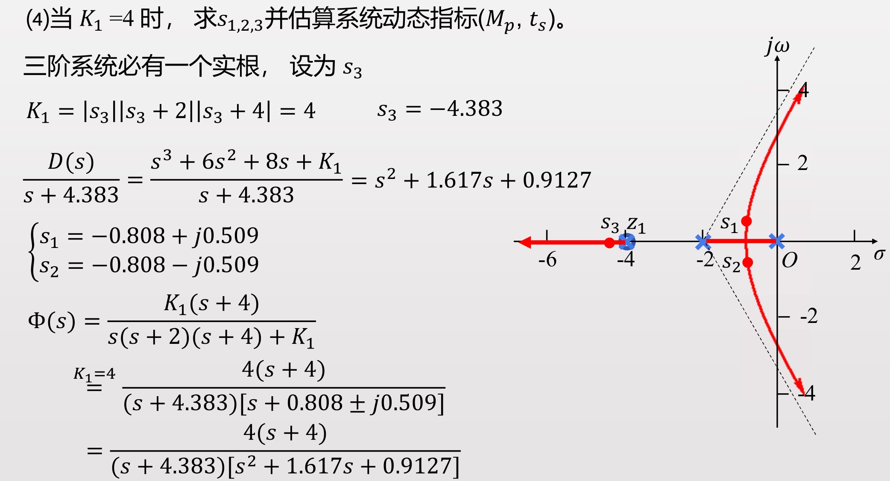

# 线性系统的根轨迹分析
- [线性系统的根轨迹分析](#线性系统的根轨迹分析)
  - [1 根轨迹基本概念](#1-根轨迹基本概念)
  - [2 根轨迹的绘制方法(判断点在不在轨迹上)](#2-根轨迹的绘制方法判断点在不在轨迹上)
  - [3 绘制根轨迹的基本规则](#3-绘制根轨迹的基本规则)
    - [3.1 (规则一)对称性](#31-规则一对称性)
    - [3.2 (规则二)起点和终点](#32-规则二起点和终点)
    - [3.3 (规则三)实轴上的根轨迹](#33-规则三实轴上的根轨迹)
    - [3.4 (规则四)渐近线的相位](#34-规则四渐近线的相位)
    - [3.5 (规则五)渐近线的交点](#35-规则五渐近线的交点)
      - [3.5.1 根轨迹绘制步骤总结](#351-根轨迹绘制步骤总结)
    - [3.6 (规则六)分离点](#36-规则六分离点)
    - [3.7 (规则七)与虚轴的交点](#37-规则七与虚轴的交点)
    - [3.8 (规则八)出射角和入射角](#38-规则八出射角和入射角)

- [线性系统的根轨迹分析](#线性系统的根轨迹分析)
  - [1 根轨迹基本概念](#1-根轨迹基本概念)
  - [2 根轨迹的绘制方法(判断点在不在轨迹上)](#2-根轨迹的绘制方法判断点在不在轨迹上)
  - [3 绘制根轨迹的基本规则](#3-绘制根轨迹的基本规则)
    - [3.1 (规则一)对称性](#31-规则一对称性)
    - [3.2 (规则二)起点和终点](#32-规则二起点和终点)
    - [3.3 (规则三)实轴上的根轨迹](#33-规则三实轴上的根轨迹)
    - [3.4 (规则四)渐近线的相位](#34-规则四渐近线的相位)
    - [3.5 (规则五)渐近线的交点](#35-规则五渐近线的交点)
      - [3.5.1 根轨迹绘制步骤总结](#351-根轨迹绘制步骤总结)
    - [3.6 (规则六)分离点](#36-规则六分离点)
    - [3.7 (规则七)与虚轴的交点](#37-规则七与虚轴的交点)
    - [3.8 (规则八)出射角和入射角](#38-规则八出射角和入射角)
    - [3.9 (规则九)根之和](#39-规则九根之和)
  - [4 广义根轨迹](#4-广义根轨迹)
  - [5 例题](#5-例题)

**根轨迹**：系统中的某一或某些参量有$0\rightarrow\infty$变化时，特征方程的根(闭环极点，决定系统是否稳定)在 s 平面上响应变化所描绘出来的轨迹。

**根轨迹法**：求解系统特征方程的根的图解方法。

1. 直观，形象
2. 适合研究系统中某一个参数变化时，系统的性能变化趋势
3. 近似方法，不是十分精确

- 例如调整 K 参数的时候，不知道会有如何影响可以使用根轨迹方法大致判断系统的性能趋势

## 1 根轨迹基本概念

## 2 根轨迹的绘制方法(判断点在不在轨迹上)

**基于相位条件可以画根轨迹**

## 3 绘制根轨迹的基本规则

### 3.1 (规则一)对称性

因为根必须是实数或者共轭复数，所以徐娅满足对称性约束

### 3.2 (规则二)起点和终点

起始于`开环极点`终止与零点和无穷远

### 3.3 (规则三)实轴上的根轨迹

**系统性能-`系统闭环极点`**

但是**根轨迹可以基于开环极点**去分析

### 3.4 (规则四)渐近线的相位

### 3.5 (规则五)渐近线的交点

#### 3.5.1 根轨迹绘制步骤总结

### 3.6 (规则六)分离点

### 3.7 (规则七)与虚轴的交点

### 3.8 (规则八)出射角和入射角

### 3.9 (规则九)根之和

## 4 广义根轨迹

**之前的根轨迹是基于比例项 K 的变化而绘制闭环传递函数极点(特征方程根)的分布，现在需要探究不仅限于比例系数等的变化**

**通过等效的思想(构造相同的特征方程$1+G(s)H(s)=0$)来构建$G^*$从而将其他的参数转换为比例参数**

## 5 例题

